# Rexa System Technical Documentation

read till end if ur free :D

## Overview

The Rexa system is a comprehensive platform designed to facilitate reward management and redemption within a points-based system. It comprises both a Node.js server and a React-based client application. The server handles user authentication, reward creation and management, transaction processing, and communication with a MongoDB database. The client provides a user interface for browsing rewards, redeeming points, managing profiles, and viewing transaction history. This documentation provides a detailed technical overview of the system's architecture, workflows, and implementation details.

## System Architecture


The Rexa system follows a client-server architecture. The server, built with Node.js, Express, and Mongoose, exposes a RESTful API for the client to interact with. The client, built with React, consumes this API to provide a user-friendly interface.

### Server-Side Architecture

The server-side architecture is structured as follows:

-   **`server/src/index.ts`**: The entry point of the server application. It initializes the Express app, connects to the MongoDB database, and starts the server.
-   **`server/src/app.ts`**: Configures the Express application with middleware for security (helmet, mongoSanitize, hpp), CORS, and routing.
-   **`server/src/config/config.ts`**: Loads environment variables using `dotenv` and provides a configuration object for the application.
-   **`server/src/services/logger.ts`**: Configures a Winston logger for centralized logging.
-   **`server/src/services/email.ts`**: Implements email sending functionality using Nodemailer.
-   **`server/src/routes`**: Contains route definitions for authentication, rewards, categories, requests, and transactions.
-   **`server/src/models`**: Defines Mongoose schemas for users, rewards, transactions, etc.
-   **`server/src/scripts/addPointsToExistingUsers.ts`**: A script to add initial points to existing users who don't have points assigned.

### Client-Side Architecture

The client-side architecture is structured as follows:

-   **`client/src/main.tsx`**: The entry point of the React application. It renders the `App` component.
-   **`client/src/App.tsx`**: Sets up the application's routing using `BrowserRouter` and provides an `AuthProvider` to manage authentication state.
-   **`client/src/config/config.ts`**: Defines the API URL based on the environment (development or production).
-   **`client/src/context`**: Contains context providers for authentication (`AuthContext`) and dark mode (`DarkModeContext`).
-   **`client/src/pages`**: Contains React components for different pages of the application, such as `Home`, `SignIn`, `Register`, `Profile`, `RewardDetails`, `MyRewards`, `CreateReward`, `EditReward`, `TransactionHistory`, `NotFound`, and `Documentation`.
-   **`client/src/components`**: Contains reusable React components such as `Navbar`, `Sidebar`, `UserMenu`, `RewardCard`, `LoadingSpinner`, `FloatingActionButton`, `EmptyState`, `DarkModeToggle`, `SearchAndFilter`, `PageLayout`, `ProfileIcon`, `RedeemDialog`, `SkeletonLoader`, `Toast`, `TransactionHistory`, and `Logo`.
-   **`client/src/services/api.ts`**: Defines functions for making API requests to the server.
-   **`client/src/services/mockData.ts`**: Provides mock data for development purposes.
-   **`client/src/types/transaction.ts`**: Defines the `Transaction` type used in the client.

## Key Workflows and Data Flows

### 1. User Authentication

The user authentication workflow involves the `SignIn.tsx`, `Register.tsx`, `AuthContext.tsx`, and server-side authentication routes.

**Workflow:**

1.  **Registration:**
    *   User enters registration details in `Register.tsx`.
    *   `Register.tsx` calls `authApi.register` (defined in `client/src/services/api.ts`) to send the registration data to the server.
    *   The server creates a new user and sends an OTP (One-Time Password) to the user's email via `server/src/services/email.ts`.
    *   `Register.tsx` then prompts the user to enter the OTP.
    *   The user enters the OTP, and `Register.tsx` calls `authApi.verifyOtp` to verify the OTP.
    *   Upon successful OTP verification, the user is redirected to the sign-in page.
2.  **Sign-in:**
    *   User enters credentials in `SignIn.tsx`.
    *   `SignIn.tsx` calls the `login` function from `AuthContext.tsx`.
    *   `login` function calls `authApi.login` to send the credentials to the server.
    *   The server authenticates the user and returns a JWT (JSON Web Token).
    *   `AuthContext.tsx` stores the JWT in local storage and updates the authentication state.
    *   The user is redirected to the home page.
3.  **Profile Fetching:**
    *   `UserMenu.tsx` and `Profile.tsx` call `authApi.getProfile` to fetch the user's profile information from the server.
    *   The server retrieves the user's profile from the database and returns it to the client.
    *   The client displays the user's profile information.

**Data Flow Diagram (User Authentication):**

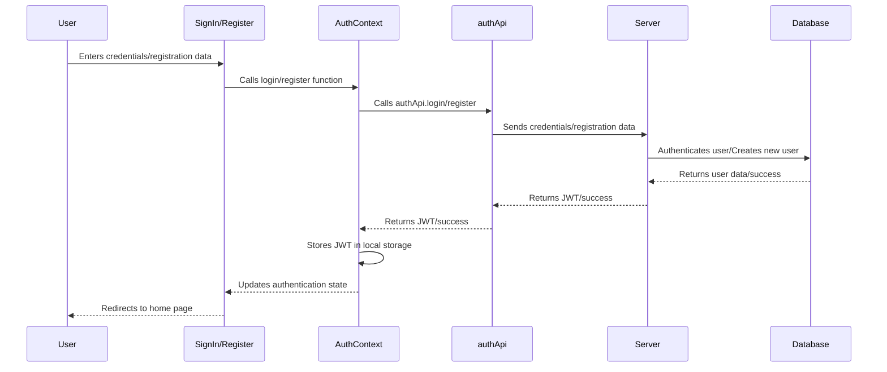

### 2. Reward Redemption

The reward redemption workflow involves the `RewardCard.tsx`, `RedeemDialog.tsx`, `transactionApi.ts`, and server-side transaction routes.

**Workflow:**

1.  **Initiation:**
    *   User views a reward in `RewardCard.tsx` and clicks the "Redeem" button.
    *   `RewardCard.tsx` opens the `RedeemDialog.tsx`.
2.  **Confirmation:**
    *   User confirms the redemption in `RedeemDialog.tsx`.
    *   `RedeemDialog.tsx` calls the `onConfirm` function, which is handled by `RewardCard.tsx`.
3.  **Transaction Processing:**
    *   `RewardCard.tsx` calls `transactionApi.redeemReward` (defined in `client/src/services/api.ts`) to send a request to the server to redeem the reward.
    *   The server creates a new transaction record in the database, deducts points from the user's account, and updates the reward status.
    *   The server returns the updated user points to the client.
4.  **Update:**
    *   `RewardCard.tsx` receives the updated user points and calls the `updatePoints` function from `AuthContext.tsx` to update the user's points in the application state.
    *   `RewardCard.tsx` closes the `RedeemDialog.tsx` and displays a success message.

**Data Flow Diagram (Reward Redemption):**

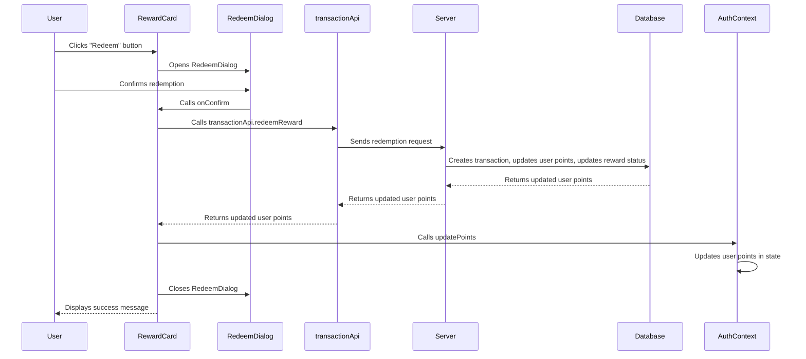

### 3. Creating a Reward

The reward creation workflow involves the `CreateReward.tsx`, `rewardApi.ts`, and server-side reward routes.

**Workflow:**

1.  **Image Upload and Parsing:**
    *   User uploads an image in `CreateReward.tsx`.
    *   `CreateReward.tsx` sends the image to an external API (`https://dark-lord-chamber-production.up.railway.app/api/process-image`) for OCR and data extraction.
    *   The API returns a JSON response containing the parsed reward data.
2.  **Data Processing and Creation:**
    *   `CreateReward.tsx` processes the parsed JSON data and displays it to the user.
    *   User can edit the parsed data.
    *   `CreateReward.tsx` calls `rewardApi.create` (defined in `client/src/services/api.ts`) to send the reward data to the server.
    *   The server creates a new reward record in the database.
    *   The server returns the created reward data to the client.
3.  **Update:**
    *   `CreateReward.tsx` receives the created reward data and navigates the user to the rewards page.

**Data Flow Diagram (Creating a Reward):**

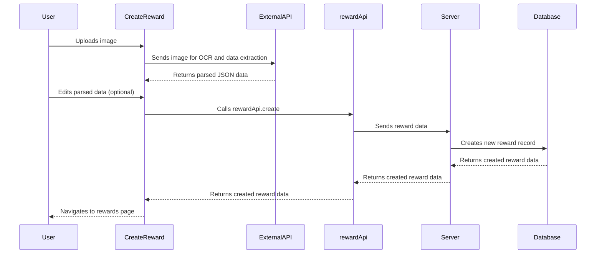

## Code Examples

### 1. Sending an Email (server/src/services/email.ts)

```typescript
import nodemailer from 'nodemailer';

interface EmailOptions {
    to: string;
    subject: string;
    html: string;
}

export const sendEmail = async ({ to, subject, html }: EmailOptions): Promise<void> => {
    try {
        // Create transporter
        const transporter = nodemailer.createTransport({
            service: 'gmail',
            auth: {
                user: process.env.EMAIL_USER,
                pass: process.env.EMAIL_PASS
            }
        });

        // Email options
        const mailOptions = {
            from: `rexa <${process.env.EMAIL_USER}>`,
            to,
            subject,
            html
        };

        // Send email
        await transporter.sendMail(mailOptions);
        console.log(`Email sent successfully to ${to}`);
    } catch (error) {
        console.error('Error sending email:', error);
        throw new Error('Failed to send email');
    }
};
```

This function uses Nodemailer to send emails. It creates a transporter with Gmail credentials (obtained from environment variables) and sends an email with the provided options.

### 2. Updating User Points (client/src/context/AuthContext.tsx)

```typescript
const AuthContext = createContext<AuthContextType | undefined>(undefined);

export const AuthProvider = ({ children }: { children: ReactNode }) => {
    const [user, setUser] = useState<User | null>(() => {
        const storedUser = localStorage.getItem('user');
        return storedUser ? JSON.parse(storedUser) : null;
    });
    const [token, setToken] = useState<string | null>(() => localStorage.getItem('token'));

    const updatePoints = (newPoints: number) => {
        setUser(prevUser => {
            if (prevUser) {
                const updatedUser = { ...prevUser, points: newPoints };
                localStorage.setItem('user', JSON.stringify(updatedUser));
                return updatedUser;
            }
            return prevUser;
        });
    };

    // ... other auth functions

    return (
        <AuthContext.Provider value={{ user, token, login, logout, isAuthenticated: !!token, updatePoints }}>
            {children}
        </AuthContext.Provider>
    );
};
```

The `updatePoints` function updates the user's points in the application state and local storage. This function is called after a successful reward redemption.

### 3. Fetching Transaction History (client/src/components/TransactionHistory.tsx)

```typescript
import { useEffect, useState } from 'react';
import { format } from 'date-fns';
import { transactionApi } from '../services/api';
import { Transaction } from '../types/transaction';
import { LoadingSpinner } from './LoadingSpinner';

export const TransactionHistory = () => {
    const [transactions, setTransactions] = useState<Transaction[]>([]);
    const [isLoading, setIsLoading] = useState(true);
    const [error, setError] = useState<string | null>(null);

    useEffect(() => {
        const fetchTransactions = async () => {
            try {
                const response = await transactionApi.getHistory();
                setTransactions(response.data);
            } catch (err) {
                console.error('Failed to fetch transactions:', err);
                setError('Failed to load transaction history');
            } finally {
                setIsLoading(false);
            }
        };

        fetchTransactions();
    }, []);

    if (isLoading) return <LoadingSpinner />;
    if (error) return <div className="text-red-500">{error}</div>;

    return (
        <div className="overflow-x-auto">
            <table className="min-w-full divide-y divide-gray-200 dark:divide-gray-700">
                <thead className="bg-gray-50 dark:bg-gray-800">
                    <tr>
                        <th className="px-6 py-3 text-left text-xs font-medium text-gray-500 uppercase tracking-wider">
                            Reward
                        </th>
                        <th className="px-6 py-3 text-left text-xs font-medium text-gray-500 uppercase tracking-wider">
                            Date
                        </th>
                        <th className="px-6 py-3 text-left text-xs font-medium text-gray-500 uppercase tracking-wider">
                            Points
                        </th>
                    </tr>
                </thead>
                <tbody className="bg-white divide-y divide-gray-200 dark:divide-gray-700">
                    {transactions.map(transaction => (
                        <tr key={transaction._id}>
                            <td className="px-6 py-4 whitespace-nowrap">
                                {transaction.reward.title}
                            </td>
                            <td className="px-6 py-4 whitespace-nowrap">
                                {format(new Date(transaction.createdAt), 'yyyy-MM-dd HH:mm:ss')}
                            </td>
                            <td className="px-6 py-4 whitespace-nowrap">
                                -{transaction.reward.points}
                            </td>
                        </tr>
                    ))}
                </tbody>
            </table>
        </div>
    );
};
```

This component fetches the transaction history from the server using `transactionApi.getHistory` and displays it in a table.

## Usage Guide

### Setting up the Development Environment

1.  **Install Node.js and npm:** Ensure that Node.js and npm are installed on your system.
2.  **Clone the repository:** Clone the Rexa repository from GitHub.
3.  **Install server-side dependencies:** Navigate to the `server` directory and run `npm install`.
4.  **Install client-side dependencies:** Navigate to the `client` directory and run `npm install`.
5.  **Configure environment variables:** Create `.env` files in both the `server` and `client` directories and configure the necessary environment variables (e.g., `MONGODB_URI`, `EMAIL_USER`, `EMAIL_PASS`, `API_URL`).
6.  **Start the server:** Navigate to the `server` directory and run `npm run dev`.
7.  **Start the client:** Navigate to the `client` directory and run `npm run dev`.

### Creating a New Reward

1.  Navigate to the "Create Reward" page.
2.  Upload an image of the coupon or reward.
3.  The system will attempt to parse the reward details from the image using OCR.
4.  Review and edit the parsed reward details.
5.  Click the "Create" button to create the reward.

### Redeeming a Reward

1.  Browse the available rewards on the home page.
2.  Click the "Redeem" button on the reward card.
3.  Confirm the redemption in the dialog box.
4.  The system will deduct the reward points from your account and update your transaction history.

### Managing User Profile

1.  Navigate to the "Profile" page.
2.  View your profile details, including your name, email, and points balance.
3.  Click the "Edit" button to edit your profile details.
4.  Save the changes.

## Implementation Details and Gotchas

### CORS Configuration

The server uses the `cors` middleware to enable Cross-Origin Resource Sharing (CORS). The `allowedOrigins` array in `server/src/app.ts` specifies the allowed origins. Ensure that the client's URL is included in this array.

### Environment Variables

The application relies on environment variables for configuration. Ensure that all necessary environment variables are set in the `.env` files.

### Error Handling

The application implements error handling using `try...catch` blocks and the `toast` library for displaying error messages to the user.

### Security Considerations

The application uses several security middleware components, including `helmet`, `mongoSanitize`, and `hpp`, to protect against common web vulnerabilities.

## Common Issues and Troubleshooting

### 1. CORS Errors

If you encounter CORS errors, ensure that the client's URL is included in the `allowedOrigins` array in `server/src/app.ts`.

### 2. Database Connection Errors

If you encounter database connection errors, ensure that the `MONGODB_URI` environment variable is set correctly and that the MongoDB server is running.

### 3. Email Sending Errors

If you encounter email sending errors, ensure that the `EMAIL_USER` and `EMAIL_PASS` environment variables are set correctly and that the Gmail account is configured to allow less secure apps.

### 4. API Request Failures

If API requests are failing, check the network tab in your browser's developer tools to see the error message returned by the server. Ensure that the server is running and that the API endpoints are configured correctly.

## Advanced Configuration and Customization Options

### 1. Customizing the Logger

The Winston logger can be customized by modifying the configuration in `server/src/services/logger.ts`. You can change the log level, format, and transport.

### 2. Adding New API Endpoints

To add new API endpoints, define the route in the appropriate route file (e.g., `server/src/routes/reward.routes.ts`) and implement the corresponding controller logic.

### 3. Customizing the UI

The client-side UI can be customized by modifying the React components in the `client/src/components` and `client/src/pages` directories.

## Performance Considerations and Optimization Strategies

### 1. Database Optimization

Optimize database queries by using indexes and efficient query patterns.

### 2. Caching

Implement caching to reduce the load on the database and improve response times.

### 3. Code Splitting

Use code splitting to reduce the initial load time of the client-side application.

### 4. Image Optimization

Optimize images to reduce their file size and improve page load times.

## Security Implications and Best Practices

### 1. Input Validation

Validate all user inputs to prevent injection attacks.

### 2. Authentication and Authorization

Implement strong authentication and authorization mechanisms to protect sensitive data.

### 3. Data Encryption

Encrypt sensitive data at rest and in transit.

### 4. Regular Security Audits

Conduct regular security audits to identify and address potential vulnerabilities.

## Rewards and User Points System: Technical Documentation

This document provides a comprehensive overview of the rewards and user points system, detailing its architecture, workflows, and implementation. The system allows users to earn points, redeem rewards, and tracks related transactions.

### 1. System Overview

The rewards and user points system comprises several key components:

*   **User Model:** Manages user accounts, including points balance, redeemed rewards, and authentication.
*   **Reward Model:** Defines available rewards with titles, descriptions, and associated images.
*   **Transaction Model:** Records all point transactions, including redemptions, transfers, and other adjustments.
*   **Reward Redemption Model:** Tracks specific instances of reward redemptions by users.
*   **OTP Model:** Manages One-Time Passwords for user verification.
*   **Category Model:** Categorizes rewards.
*   **Request Model:** Manages reward requests between users.
*   **Validators:** Enforces data integrity using Zod schemas.

This system is crucial for incentivizing user engagement, tracking reward distribution, and maintaining a secure and reliable points economy.

### 2. Technical Architecture

The system adopts a modular architecture, with each component responsible for a specific aspect of the rewards and points management.

**2.1. Models:**

The core of the system revolves around Mongoose models, which define the structure and behavior of data stored in MongoDB.

*   **User Model (`server/src/models/user.model.ts`):**

    ```typescript
    import mongoose, { Schema, Document } from 'mongoose';
    import bcrypt from 'bcryptjs';

    export interface IUser extends Document {
        name: string;
        email: string;
        password: string;
        points: number;
        redeemedRewards: number;
        isVerified: boolean;
        createdAt: Date;
        updatedAt: Date;
        comparePassword(candidatePassword: string): Promise<boolean>;
    }

    const userSchema = new Schema({
        name: { type: String, required: true },
        email: { type: String, required: true, unique: true },
        password: { type: String, required: true },
        points: { type: Number, default: 0 },
        redeemedRewards: { type: Number, default: 0 },
        isVerified: { type: Boolean, default: false },
    }, { timestamps: true });

    userSchema.pre('save', async function(next) {
        if (!this.isModified('password')) return next();
        try {
            const salt = await bcrypt.genSalt(10);
            this.password = await bcrypt.hash(this.password, salt);
            next();
        } catch (error: any) {
            next(error);
        }
    });

    userSchema.methods.comparePassword = async function(candidatePassword: string): Promise<boolean> {
        try {
            return await bcrypt.compare(candidatePassword, this.password);
        } catch (error) {
            throw new Error('Password comparison failed');
        }
    };

    export const User = mongoose.model<IUser>('User', userSchema);
    ```

    *   Defines the `IUser` interface and `userSchema`.
    *   Includes fields for name, email, password, points, redeemed rewards, and verification status.
    *   Uses `bcryptjs` for password hashing before saving.
    *   Provides a `comparePassword` method for password verification.
    *   Exports the `User` model.

*   **Reward Model (`server/src/models/reward.model.ts`):**

    ```typescript
    import mongoose, { Schema, Document } from 'mongoose';

    export interface IReward extends Document {
        title: string;
        image_url : string;
        description: string;
        points: number;
    }

    const rewardSchema = new Schema({
        title: { type: String, required: true },
        image_url: { type: String, required: true },
        description: { type: String, required: true },
        points: { type: Number, required: true },
    });

    export const Reward = mongoose.model<IReward>('Reward', rewardSchema);
    ```

    *   Defines the `IReward` interface and `rewardSchema`.
    *   Includes fields for title, image URL, description, and points cost.
    *   Exports the `Reward` model.

*   **Transaction Model (`server/src/models/transaction.model.ts`):**

    ```typescript
    import mongoose, { Schema, Document } from 'mongoose';

    export interface ITransaction extends Document {
        fromUser: mongoose.Types.ObjectId;
        toUser: mongoose.Types.ObjectId;
        points: number;
        reward: mongoose.Types.ObjectId;
        type: 'redemption';
        createdAt: Date;
    }

    const transactionSchema = new Schema({
        fromUser: { type: Schema.Types.ObjectId, ref: 'User', required: true },
        toUser: { type: Schema.Types.ObjectId, ref: 'User', required: true },
        points: { type: Number, required: true },
        reward: { type: Schema.Types.ObjectId, ref: 'Reward' },
        type: { type: String, enum: ['redemption'], required: true },
    }, { timestamps: true });

    export const Transaction = mongoose.model<ITransaction>('Transaction', transactionSchema);
    ```

    *   Defines the `ITransaction` interface and `transactionSchema`.
    *   Includes fields for `fromUser`, `toUser`, `points`, `reward`, and `type`.
    *   Uses `Schema.Types.ObjectId` to reference `User` and `Reward` models.
    *   Exports the `Transaction` model.

*   **Reward Redemption Model (`server/src/models/rewardRedemption.model.ts`):**

    ```typescript
    import mongoose from 'mongoose';
    import User from './User';
    import { Reward } from './reward.model';

    const rewardRedemptionSchema = new mongoose.Schema({
        userId: { type: mongoose.Schema.Types.ObjectId, ref: 'User', required: true },
        rewardId: { type: mongoose.Schema.Types.ObjectId, ref: 'Reward', required: true },
        redeemedAt: { type: Date, default: Date.now },
    });

    rewardRedemptionSchema.index({ userId: 1, redeemedAt: -1 });

    export const RewardRedemption = mongoose.model('RewardRedemption', rewardRedemptionSchema);
    ```

    *   Defines the `rewardRedemptionSchema`.
    *   Includes fields for `userId`, `rewardId`, and `redeemedAt`.
    *   Uses `mongoose.Schema.Types.ObjectId` to reference `User` and `Reward` models.
    *   Exports the `RewardRedemption` model.

*   **OTP Model (`server/src/models/otp.model.ts`):**

    ```typescript
    import mongoose, { Schema, Document } from 'mongoose';

    export interface IOtp extends Document {
        email: string;
        otp: string;
        expiresAt: Date;
    }

    const otpSchema = new Schema({
        email: { type: String, required: true },
        otp: { type: String, required: true },
        expiresAt: { type: Date, required: true },
    });

    export const Otp = mongoose.model<IOtp>('Otp', otpSchema);
    ```

    *   Defines the `IOtp` interface and `otpSchema`.
    *   Includes fields for `email`, `otp`, and `expiresAt`.
    *   Exports the `Otp` model.

*   **Category Model (`server/src/models/category.model.ts`):**

    ```typescript
    import mongoose from 'mongoose';

    const categorySchema = new mongoose.Schema({
        name: { type: String, required: true, unique: true },
        slug: { type: String, unique: true },
    });

    categorySchema.pre('save', function(next) {
        if (this.isModified('name')) {
            this.slug = this.name.toLowerCase().replace(/[^a-z0-9]+/g, '-');
        }
        next();
    });

    export const Category = mongoose.model('Category', categorySchema);
    ```

    *   Defines the `categorySchema`.
    *   Includes fields for `name` and `slug`.
    *   Generates a slug from the name before saving.
    *   Exports the `Category` model.

*   **Request Model (`server/src/models/Request.ts`):**

    ```typescript
    import mongoose, { Schema, Document } from 'mongoose';

    export interface IRequest extends Document {
      reward: mongoose.Types.ObjectId;
      sender: mongoose.Types.ObjectId;
      receiver: mongoose.Types.ObjectId;
      status: 'pending' | 'accepted' | 'rejected';
      message?: string;
      createdAt: Date;
    }

    const RequestSchema = new Schema({
      reward: {
        type: Schema.Types.ObjectId,
        ref: 'Reward',
        required: true,
      },
      sender: {
        type: Schema.Types.ObjectId,
        ref: 'User',
        required: true,
      },
      receiver: {
        type: Schema.Types.ObjectId,
        ref: 'User',
        required: true,
      },
      status: {
        type: String,
        enum: ['pending', 'accepted', 'rejected'],
        default: 'pending',
      },
      message: {
        type: String,
      },
    }, { timestamps: true });
    ```

    *   Defines the `RequestSchema`.
    *   Includes fields for `reward`, `sender`, `receiver`, `status`, `message`, and `createdAt`.
    *   Uses `Schema.Types.ObjectId` to reference `User` and `Reward` models.

**2.2. Validators:**

Zod validators are used to ensure data integrity and consistency.

*   **Reward Validator (`server/src/validators/reward.validator.ts`):**

    ```typescript
    import { z } from 'zod';

    export const rewardSchema = z.object({
        title: z.string().min(3, 'Title must be at least 3 characters'),
        description: z.string().min(10, 'Description must be at least 10 characters'),
    });
    ```

    *   Defines a Zod schema for validating reward data.
    *   Ensures that the title is at least 3 characters long and the description is at least 10 characters long.

**2.3. Client-Side Types:**

Typescript interfaces are used to define the structure of data on the client-side.

*   **Transaction Type (`client/src/types/transaction.ts`):**

    ```typescript
    export interface Transaction {
        _id: string;
        fromUser: {
            _id: string;
            username: string;
        };
        toUser: {
            _id: string;
            username: string;
        };
        points: number;
        reward: {
            _id: string;
            title: string;
        };
        type: string;
        createdAt: string;
    }
    ```

    *   Defines the `Transaction` interface.
    *   Includes fields for `_id`, `fromUser`, `toUser`, `points`, `reward`, `type`, and `createdAt`.

*   **User Type (`client/src/types/User.ts`):**

    ```typescript
    interface User {
        username: string;
        // ... other existing properties ...
    }
    ```

    *   Defines the `User` interface.
    *   Includes a field for `username`.

### 3. Main Workflows and Data Flows

**3.1. User Registration:**

1.  The user submits registration data (name, email, password).
2.  The server validates the data.
3.  The server hashes the password using `bcryptjs`.
4.  A new user document is created in the database.

**3.2. Reward Creation:**

1.  An administrator submits reward data (title, description, image URL, points).
2.  The server validates the data using the `rewardSchema`.
3.  A new reward document is created in the database.

**3.3. Reward Redemption:**

1.  A user initiates a reward redemption request.
2.  The server checks if the user has sufficient points.
3.  A new transaction document is created, recording the point deduction.
4.  A new reward redemption document is created, linking the user and the reward.
5.  The user's points balance is updated.

**3.4. Requesting a Reward:**

1.  A user initiates a reward request to another user.
2.  The server validates the data.
3.  A new request document is created in the database.

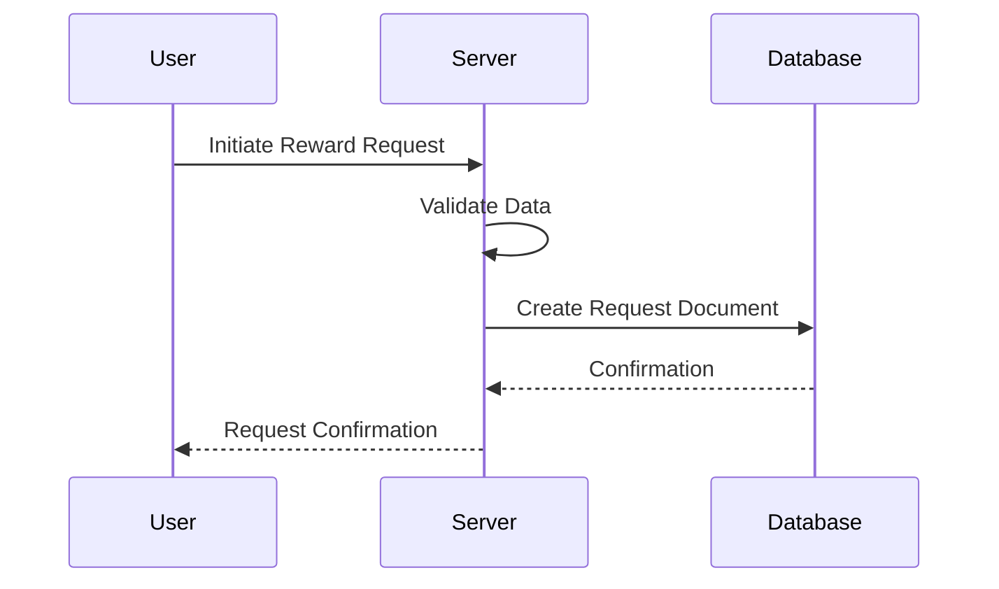

**3.5. Accepting a Reward Request:**

1.  A user accepts a reward request from another user.
2.  The server validates the data.
3.  The server checks if the sender has sufficient points.
4.  A new transaction document is created, recording the point deduction from the sender and addition to the receiver.
5.  The sender's and receiver's points balance are updated.
6.  The request status is updated to "accepted".

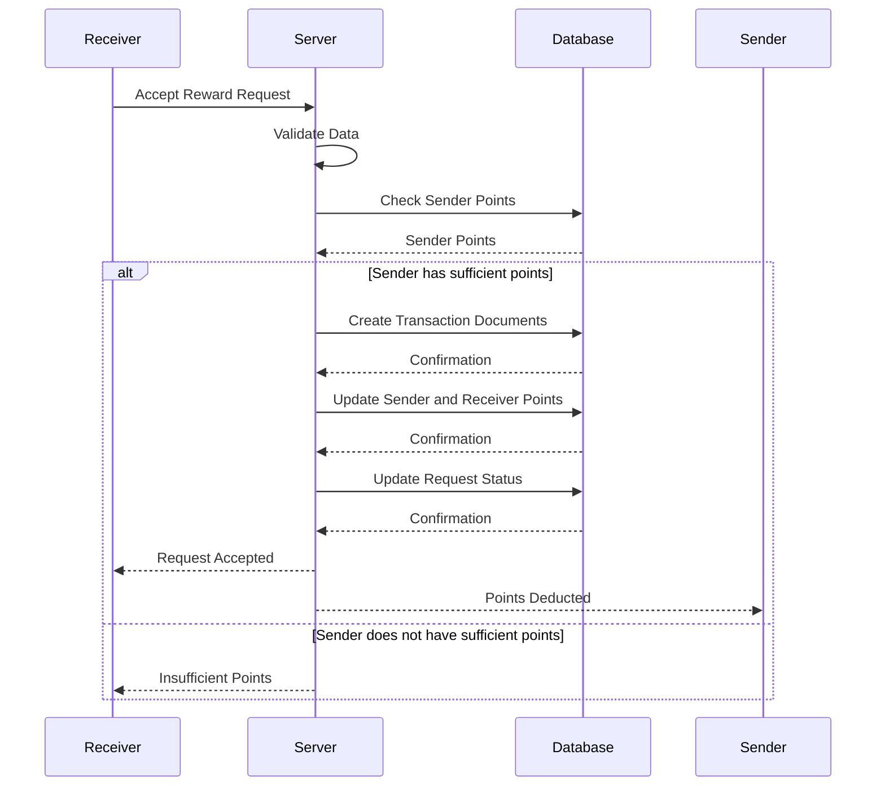

### 4. Code Examples

**4.1. Creating a New User:**

```typescript
import { User } from '../models/user.model';

async function createUser(name: string, email: string, password: string) {
    try {
        const newUser = new User({ name, email, password });
        await newUser.save();
        console.log('User created successfully');
    } catch (error) {
        console.error('Error creating user:', error);
    }
}
```

**4.2. Creating a New Reward:**

```typescript
import { Reward } from '../models/reward.model';
import { rewardSchema } from '../validators/reward.validator';

async function createReward(title: string, description: string, image_url: string, points: number) {
    try {
        const validatedData = rewardSchema.parse({ title, description }); // Validate data
        const newReward = new Reward({ ...validatedData, image_url, points });
        await newReward.save();
        console.log('Reward created successfully');
    } catch (error) {
        console.error('Error creating reward:', error);
    }
}
```

**4.3. Redeeming a Reward:**

```typescript
import { User } from '../models/user.model';
import { Reward } from '../models/reward.model';
import { Transaction } from '../models/transaction.model';
import { RewardRedemption } from '../models/rewardRedemption.model';

async function redeemReward(userId: string, rewardId: string) {
    try {
        const user = await User.findById(userId);
        const reward = await Reward.findById(rewardId);

        if (!user || !reward) {
            throw new Error('User or reward not found');
        }

        if (user.points < reward.points) {
            throw new Error('Insufficient points');
        }

        // Create transaction
        const transaction = new Transaction({
            fromUser: userId,
            toUser: userId, // Redemption is to the same user
            points: -reward.points,
            reward: rewardId,
            type: 'redemption',
        });
        await transaction.save();

        // Create reward redemption record
        const rewardRedemption = new RewardRedemption({
            userId: userId,
            rewardId: rewardId,
        });
        await rewardRedemption.save();

        // Update user points
        user.points -= reward.points;
        user.redeemedRewards += 1;
        await user.save();

        console.log('Reward redeemed successfully');
    } catch (error) {
        console.error('Error redeeming reward:', error);
    }
}
```

### 5. Usage Guide

**5.1. Setting up the Models:**

Ensure that Mongoose is connected to your MongoDB database. Import the necessary models and use them to interact with the database.

**5.2. Implementing Validation:**

Use the Zod schemas to validate data before saving it to the database. This helps prevent invalid data from being stored and ensures data consistency.

**5.3. Handling Transactions:**

When performing operations that involve transferring points, create transaction records to maintain an audit trail.

### 6. Implementation Details and Gotchas

*   **Password Hashing:** Always hash passwords using `bcryptjs` before storing them in the database.
*   **Data Validation:** Use Zod schemas to validate data before saving it to the database.
*   **Transaction Management:** Ensure that transactions are atomic and consistent.
*   **Error Handling:** Implement proper error handling to prevent unexpected behavior.
*   **Referential Integrity:** Use `Schema.Types.ObjectId` to maintain referential integrity between models.

### 7. Common Issues and Troubleshooting

*   **Mongoose Connection Errors:** Verify that Mongoose is properly connected to the MongoDB database.
*   **Validation Errors:** Check the Zod schemas to ensure that the data is valid.
*   **Transaction Errors:** Ensure that transactions are atomic and consistent.
*   **Authentication Errors:** Verify that the user's credentials are correct.

### 8. Advanced Configuration and Customization Options

*   **Custom Validation Rules:** Add custom validation rules to the Zod schemas.
*   **Custom Transaction Types:** Add custom transaction types to the `Transaction` model.
*   **Custom Reward Redemption Logic:** Customize the reward redemption logic to suit your specific needs.
*   **Different Hashing Algorithms**: Configure bcrypt to use different hashing rounds.

### 9. Performance Considerations and Optimization Strategies

*   **Indexing:** Add indexes to frequently queried fields to improve query performance.
*   **Caching:** Cache frequently accessed data to reduce database load.
*   **Pagination:** Implement pagination for large datasets to improve performance.
*   **Database Optimization:** Optimize the MongoDB database for performance.

### 10. Security Implications and Best Practices

*   **Password Security:** Always hash passwords using `bcryptjs` before storing them in the database.
*   **Data Validation:** Use Zod schemas to validate data before saving it to the database.
*   **Authentication and Authorization:** Implement proper authentication and authorization mechanisms to protect sensitive data.
*   **Input Sanitization:** Sanitize user input to prevent cross-site scripting (XSS) attacks.
*   **Rate Limiting:** Implement rate limiting to prevent denial-of-service (DoS) attacks.

This documentation provides a comprehensive overview of the rewards and user points system. By following these guidelines, developers can effectively implement and maintain a secure and reliable points economy.


## Authentication and Authorization System Documentation

This document provides a comprehensive overview of the authentication and authorization system, detailing its components, workflows, and usage. The system is designed to manage user authentication, authorization, and related functionalities such as reward redemption and transaction history.

### 1. System Overview

The authentication and authorization system handles user registration, login, profile management, and access control to protected resources. It utilizes JSON Web Tokens (JWT) for authentication and middleware to enforce authorization policies. The system also incorporates rate limiting to prevent abuse and error handling to provide informative feedback to the client.

### 2. Technical Architecture

The system follows a layered architecture, comprising the following key components:

*   **Routes:** Express routes define the API endpoints and map them to controller functions.
*   **Middleware:** Middleware functions handle authentication, authorization, rate limiting, and error handling.
*   **Controllers:** Controller functions implement the business logic for each API endpoint.
*   **Models:** Mongoose models define the data structures and interact with the MongoDB database.
*   **Services:** Services provide reusable utility functions, such as logging.
*   **Types:** TypeScript declaration files define custom types and interfaces.

**Component Relationships:**

The following diagram illustrates the relationships between the main components:

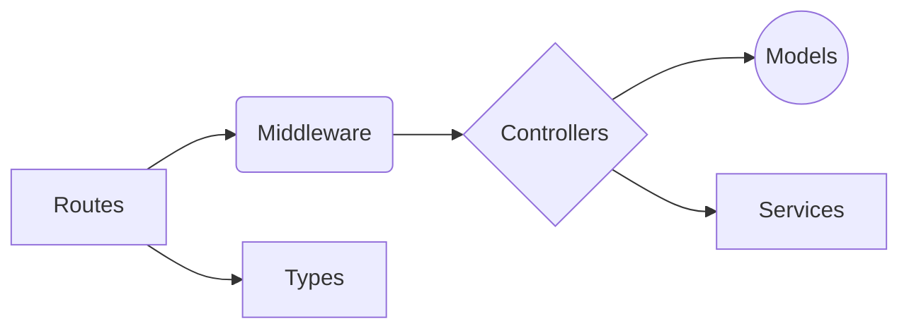

**Explanation:**

*   **Routes** pass incoming requests to **Middleware** for processing.
*   **Middleware** can use **Controllers** to handle specific logic.
*   **Controllers** interact with **Models** to access and manipulate data.
*   **Controllers** can also use **Services** for utility functions.
*   **Routes** and **Middleware** use **Types** for type safety.

### 3. Main Workflows and Data Flows

#### 3.1. User Registration and Login

1.  **Registration:**
    *   The user submits registration data (name, email, password) to the `/auth/register` endpoint.
    *   The `register` controller function creates a new user in the database.
    *   An OTP is generated and sent to the user's email for verification.
2.  **Login:**
    *   The user submits login credentials (email, password) to the `/auth/login` endpoint.
    *   The `login` controller function authenticates the user against the database.
    *   A JWT is generated and sent to the client.
3.  **OTP Verification:**
    *   The user submits the OTP to the `/auth/verify-otp` endpoint.
    *   The `verifyOtp` controller function verifies the OTP and activates the user account.

**Data Flow Diagram:**

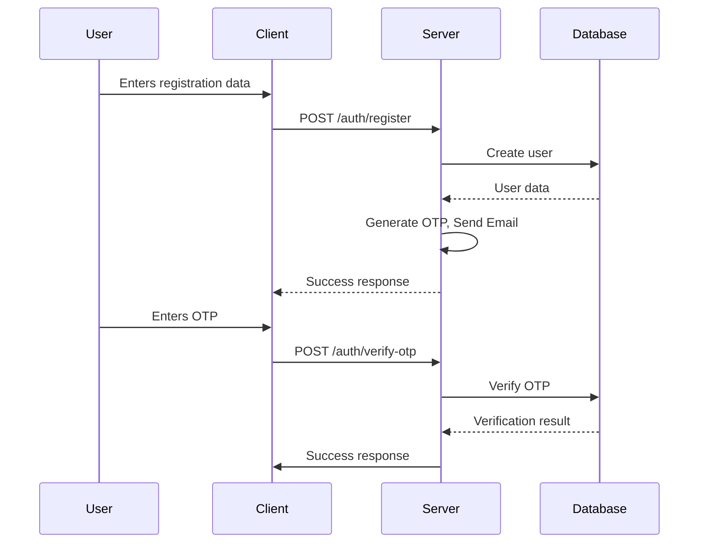

#### 3.2. Reward Redemption

1.  The user initiates a reward redemption request via the client application.
2.  The client sends a `POST` request to the `/transactions/redeem/:rewardId` endpoint, including the reward ID.
3.  The server's `redeemReward` controller function processes the request.
4.  The controller verifies user authentication and authorization.
5.  The controller checks if the user has sufficient points to redeem the reward.
6.  If the user has sufficient points, the controller updates the user's points balance and creates a transaction record.
7.  The controller returns a success response to the client.

**Workflow Visualization:**

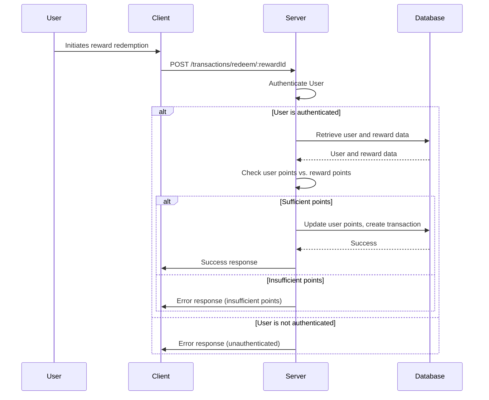

#### 3.3. Creating a Request for a Reward

1.  The user initiates a request for a reward via the client application.
2.  The client sends a `POST` request to the `/requests/:rewardId` endpoint, including the reward ID.
3.  The server's `createRequest` controller function processes the request.
4.  The controller verifies user authentication and authorization.
5.  The controller checks if the reward exists and is available.
6.  The controller creates a new request record in the database.
7.  The controller returns a success response to the client.

**Workflow Visualization:**

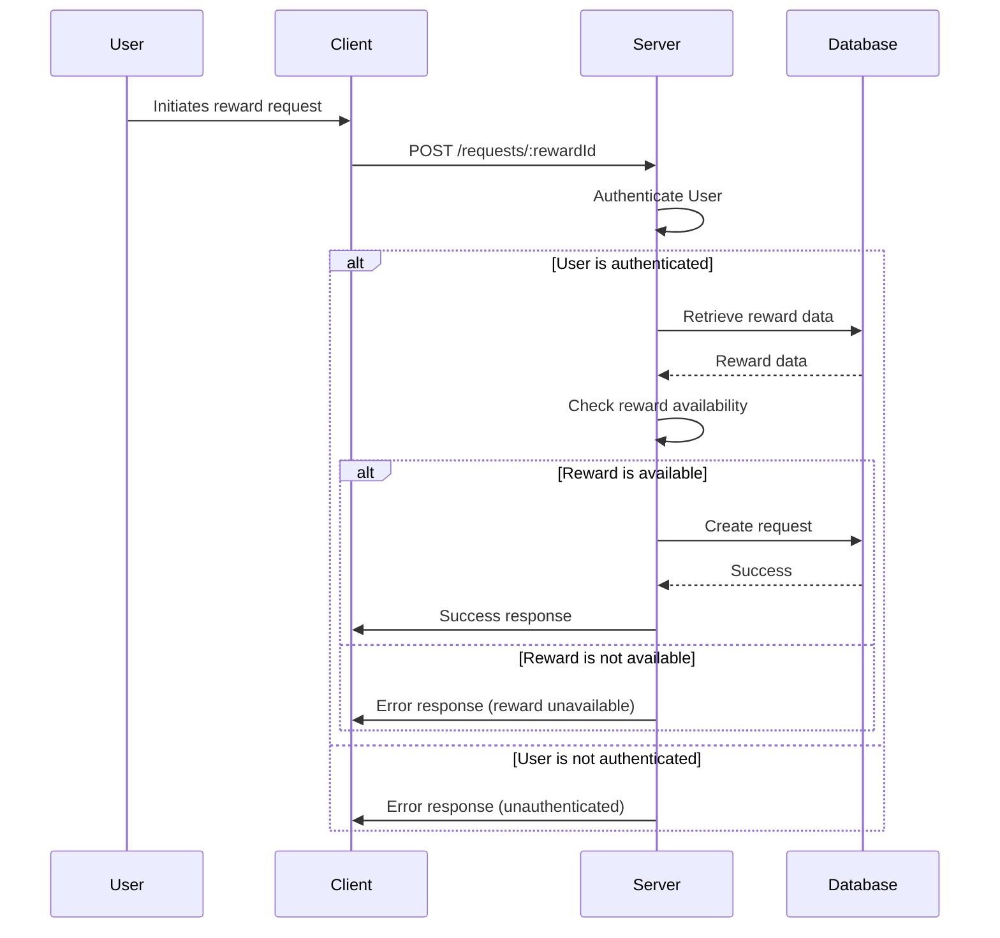

### 4. Code Examples

#### 4.1. Extending Express Request with User Data

The `express.d.ts` file extends the Express `Request` interface to include a `user` property, which stores the authenticated user's ID.

```typescript
import { Request } from 'express';

declare global {
    namespace Express {
        interface Request {
            user?: {
                userId: string;
            }
        }
    }
}
```

This allows middleware and controller functions to access the authenticated user's ID from the `req.user` object.

**Usage Example:**

```typescript
import { AuthRequest } from '../middleware/auth';
import { Response } from 'express';

export const getTransactionHistory = async (req: AuthRequest, res: Response) => {
    const userId = req.user?.userId;
    // ...
};
```

#### 4.2. Rate Limiting

The `rateLimiter.ts` file defines rate limiting middleware to prevent abuse of API endpoints.

```typescript
import rateLimit from 'express-rate-limit';
import { CONFIG } from '../config/config';

export const apiLimiter = rateLimit({
    windowMs: 15 * 60 * 1000, // 15 minutes
    max: 100
});

export const authLimiter = rateLimit({
    windowMs: 60 * 60 * 1000, // 1 hour
    max: 5
});

export const redeemLimiter = CONFIG.RATE_LIMIT_ENABLED
    ? rateLimit({
        windowMs: CONFIG.RATE_LIMIT_WINDOW,
```

**Usage Example:**

```typescript
import { apiLimiter, authLimiter } from '../middleware/rateLimiter';
import express from 'express';

const router = express.Router();

router.post('/login', authLimiter, /* ... */);
router.get('/data', apiLimiter, /* ... */);
```

#### 4.3. Error Handling

The `errorHandler.ts` file defines a global error handler that logs errors and sends informative responses to the client.

```typescript
import { Request, Response, NextFunction } from 'express';
import logger from '../services/logger';

export const errorHandler = (
    err: any,
    req: Request,
    res: Response,
    next: NextFunction
) => {
    logger.error('Error:', {
        message: err.message,
        stack: err.stack,
        path: req.path,
        method: req.method
    });

    if (err.name === 'ValidationError') {
        return res.status(400).json({
            message: 'Validation Error',
            errors: Object.values(err.errors).map((e: any) => e.message)
        });
    }

    if (err.name === 'MongoError' && err.code === 11000) {
        return res.status(400).json({
            message: 'Duplicate key error',
```

**Usage Example:**

```typescript
import express from 'express';
import { errorHandler } from '../middleware/errorHandler';

const app = express();

app.get('/error', () => {
  throw new Error('This is a test error');
});

app.use(errorHandler);
```

### 5. Practical Usage Guide

#### 5.1. Protecting Routes with Authentication

The `auth` middleware is used to protect routes that require authentication.

```typescript
import { auth } from '../middleware/auth';
import express from 'express';

const router = express.Router();

router.get('/profile', auth, (req, res) => {
  // Access req.user.userId here
});
```

#### 5.2. Creating a New Reward

The `createReward` controller function handles the creation of new rewards.

```typescript
import { createReward } from '../controllers/rewardController';
import express from 'express';
import { auth } from '../middleware/auth';

const router = express.Router();

router.post('/', auth, createReward);
```

#### 5.3. Fetching Transaction History

The `getTransactionHistory` controller function retrieves the transaction history for a user.

```typescript
import { getTransactionHistory } from '../controllers/transactionController';
import express from 'express';
import { auth } from '../middleware/auth';

const router = express.Router();

router.get('/history', auth, getTransactionHistory);
```

### 6. Important Implementation Details and Gotchas

*   **JWT Expiration:** JWTs have an expiration time. The client must refresh the token before it expires to maintain the session.
*   **Error Handling:** Proper error handling is crucial for providing a good user experience. The `errorHandler` middleware should be used to catch and handle all errors.
*   **Rate Limiting:** Rate limiting should be configured appropriately to prevent abuse without impacting legitimate users.
*   **Database Security:** Ensure that the database is properly secured to prevent unauthorized access.

### 7. Common Issues and Troubleshooting

*   **Authentication Issues:**
    *   Verify that the JWT is valid and has not expired.
    *   Check that the user's credentials are correct.
    *   Ensure that the `auth` middleware is properly configured.
*   **Authorization Issues:**
    *   Verify that the user has the necessary permissions to access the requested resource.
    *   Check that the authorization middleware is properly configured.
*   **Rate Limiting Issues:**
    *   If you are being rate limited, try again later.
    *   If you are a legitimate user and are being rate limited, contact the administrator.
*   **Database Connection Issues:**
    *   Verify that the database server is running.
    *   Check that the connection string is correct.
    *   Ensure that the database user has the necessary permissions.

### 8. Advanced Configuration and Customization Options

*   **JWT Configuration:** The JWT secret and expiration time can be configured in the `config.ts` file.
*   **Rate Limiting Configuration:** The rate limiting parameters (windowMs, max) can be configured in the `rateLimiter.ts` file.
*   **Logging Configuration:** The logging level and output can be configured in the `logger.ts` file.

### 9. Performance Considerations and Optimization Strategies

*   **Database Queries:** Optimize database queries to improve performance. Use indexes where appropriate.
*   **Caching:** Cache frequently accessed data to reduce database load.
*   **Load Balancing:** Use a load balancer to distribute traffic across multiple servers.
*   **Code Optimization:** Optimize code to reduce execution time.

### 10. Security Implications and Best Practices

*   **JWT Security:** Protect the JWT secret. Do not store it in the client-side code.
*   **Input Validation:** Validate all user input to prevent injection attacks.
*   **Output Encoding:** Encode all output to prevent cross-site scripting (XSS) attacks.
*   **Password Hashing:** Use a strong password hashing algorithm to protect user passwords.
*   **Regular Security Audits:** Conduct regular security audits to identify and address vulnerabilities.

This documentation provides a comprehensive overview of the authentication and authorization system. By understanding the components, workflows, and best practices, developers can effectively use and maintain this system.


## Authentication System Documentation

This document provides a comprehensive overview of the authentication system, covering registration, login, profile management, and OTP verification. It details the architecture, workflows, and implementation details necessary for developers to understand and utilize the system effectively.

### System Overview

The authentication system is responsible for managing user accounts, verifying user identities, and controlling access to protected resources. It employs a multi-faceted approach, including:

*   **Registration:** Allows new users to create accounts with email verification.
*   **Login:** Authenticates existing users and grants access to the application.
*   **Profile Management:** Enables users to view and update their profile information.
*   **OTP Verification:** Uses One-Time Passwords (OTPs) for email verification and security.
*   **JWT Authentication:** Employs JSON Web Tokens (JWTs) for secure session management.

This system is crucial for ensuring the security and integrity of the application by verifying user identities and protecting sensitive data.

### Technical Architecture

The authentication system is structured with a clear separation of concerns, utilizing the following components:

*   **Validators (`auth.validator.ts`):** Defines schemas for validating user input during registration and login using Zod.
*   **Routes (`auth.routes.ts`):** Defines the API endpoints for authentication-related operations using Express.js.
*   **Middleware (`auth.ts`):** Implements authentication middleware to protect routes and verify JWT tokens.
*   **Controllers (`authController.ts`):** Handles the business logic for authentication operations, including user creation, OTP generation, and token issuance.
*   **Models (`user.model.ts`, `otp.model.ts` - *not provided, but implied*):** Defines the data structures for users and OTPs using Mongoose (assumed).
*   **Configuration (`jwt.config.ts`, `config.ts` - *partially provided*):** Stores configuration settings for JWTs and other authentication parameters.
*   **Services (`email.service.ts` - *not provided, but implied*):** Provides email sending functionality for OTP delivery.
*   **Client Services (`auth.service.ts`):** Provides client-side methods for interacting with the authentication API.
*   **Client Context (`AuthContext.tsx`):** Manages authentication state on the client-side using React Context.

**Component Relationships:**

*   `auth.routes.ts` imports `authController.ts` to handle route logic and `auth.ts` for authentication middleware.
*   `authController.ts` imports `user.model.ts`, `otp.model.ts`, `jwt.config.ts`, `auth.ts`, and `email.service.ts` to perform authentication tasks.
*   `auth.ts` imports `jwt` and `config.ts` to verify JWT tokens.
*   `auth.validator.ts` is used by `authController.ts` (implicitly) to validate request bodies.
*   `auth.service.ts` imports `api` (assumed to be an Axios instance) to make API requests to the server.
*   `AuthContext.tsx` imports `auth.service.ts` to handle login and logout and `api` to fetch user profile.

### Data Flow Diagrams

**1. Registration Workflow:**

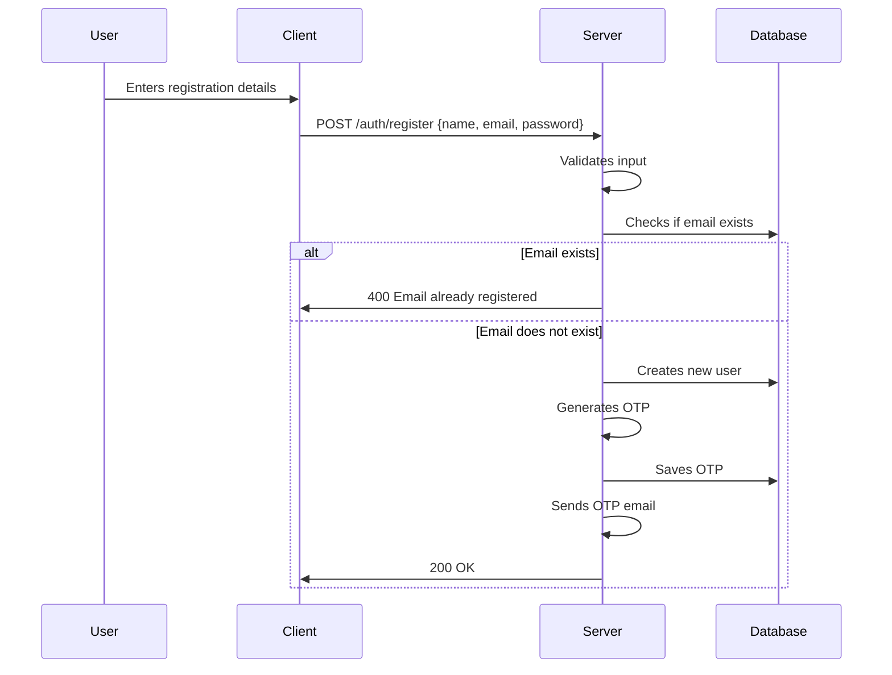

**2. Login Workflow:**

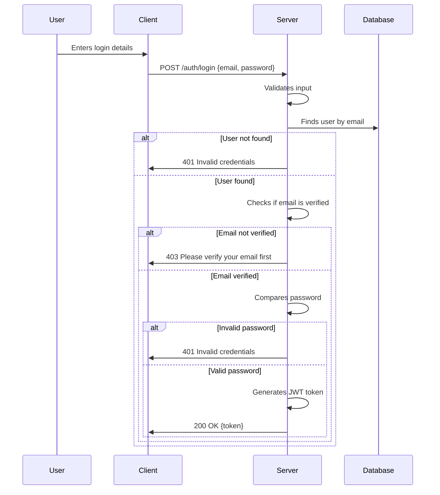

**3. Profile Update Workflow:**

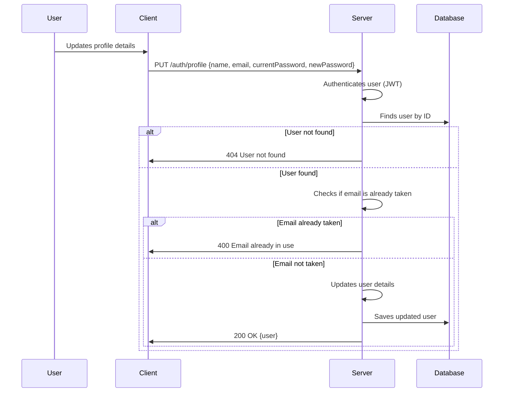

### Main Workflows and Data Flows

**1. User Registration:**

1.  The user submits their registration details (name, email, password) through the client-side application.
2.  The client sends a `POST` request to the `/auth/register` endpoint on the server.
3.  The server validates the input using the `registerSchema` defined in `auth.validator.ts`.
4.  The server checks if the email address is already registered in the database.
5.  If the email is not registered, the server creates a new user record in the database with `isVerified` set to `false`.
6.  The server generates a 6-digit OTP using the `generateOtp` function.
7.  The server saves the OTP in the `Otp` model with an expiration time of 10 minutes.
8.  The server sends an email to the user's email address containing the OTP.
9.  The server responds to the client with a success message.

**2. Email Verification (OTP):**

1.  The user receives the OTP in their email and enters it into the client-side application.
2.  The client sends a `POST` request to the `/auth/verify-otp` endpoint on the server, including the user ID and OTP.
3.  The server validates the input.
4.  The server finds the user by ID.
5.  The server finds the OTP associated with the user's email.
6.  The server checks if the OTP has expired.
7.  If the OTP is valid and not expired, the server updates the user's `isVerified` field to `true` in the database.
8.  The server deletes the OTP record from the database.
9.  The server generates a JWT token for the user.
10. The server responds to the client with a success message and the JWT token.

**3. User Login:**

1.  The user submits their login credentials (email, password) through the client-side application.
2.  The client sends a `POST` request to the `/auth/login` endpoint on the server.
3.  The server validates the input using the `loginSchema` defined in `auth.validator.ts`.
4.  The server retrieves the user record from the database based on the provided email address.
5.  The server checks if the user's email is verified (`isVerified` is `true`).
6.  The server compares the provided password with the hashed password stored in the database using `bcrypt.compare`.
7.  If the credentials are valid, the server generates a JWT token for the user.
8.  The server responds to the client with the JWT token.

**4. Profile Management:**

1.  The user accesses their profile page in the client-side application.
2.  The client retrieves the JWT token from local storage and includes it in the `Authorization` header of subsequent requests.
3.  The client sends a `GET` request to the `/auth/profile` endpoint on the server.
4.  The server authenticates the user using the JWT token via the `auth` middleware.
5.  The server retrieves the user's profile information from the database based on the user ID extracted from the JWT token.
6.  The server responds to the client with the user's profile information (excluding the password).
7.  The user updates their profile information and submits the changes.
8.  The client sends a `PUT` request to the `/auth/profile` endpoint on the server with the updated profile data.
9.  The server authenticates the user using the JWT token.
10. The server updates the user's profile information in the database.
11. The server responds to the client with the updated user profile information.

### Code Examples

**1. Registering a New User (`authController.ts`):**

```typescript
export const register = async (req: Request, res: Response) => {
    try {
        const { name, email, password } = req.body;

        // Validate input
        if (!name || !email || !password) {
            return res.status(400).json({ 
                message: 'Please provide all required fields' 
            });
        }

        // Check if email already exists
        const existingUser = await User.findOne({ email });
        if (existingUser) {
            return res.status(400).json({ 
                message: 'Email already registered' 
            });
        }

        // Create new user with initial points and isVerified false
        const user = new User({
            name,
            email,
            password,
            points: 100,
            redeemedRewards: 0,
            isVerified: false
        });

        await user.save();

        // Generate and save OTP
        const otp = generateOtp();
        const otpDoc = new Otp({
            email,
            otp,
            expiresAt: new Date(Date.now() + 10 * 60 * 1000) // 10 minutes expiry
        });
        await otpDoc.save();

        // Send OTP email
        const htmlContent = `
            <div style="font-family: Arial, sans-serif; max-width: 600px; margin: auto; padding: 20px;">
                <h2>Welcome to reXa!</h2>
                <p>Thank you for registering. Please verify your email using the OTP below:</p>
                <h3 style="color: #007bff;">${otp}</h3>
                <p>This code is valid for 10 minutes.</p>
            </div>
        `;
        await sendEmail({
            to: email,
            subject: 'Verify Your Email Address',
            html: htmlContent,
        });

        res.json({
            message: 'Registration successful. Please check your email to verify your account.'
        });

    } catch (error) {
        console.error('Registration error:', error);
        res.status(500).json({ 
            message: 'Server error during registration' 
        });
    }
};
```

**2. Authenticating a User (`authController.ts`):**

```typescript
export const login = async (req: Request, res: Response) => {
    try {
        const { email, password } = req.body;

        const user = await User.findOne({ email });
        if (!user) {
            return res.status(401).json({ message: 'Invalid credentials' });
        }

        // Check if email is verified
        if (!user.isVerified) {
            return res.status(403).json({ message: 'Please verify your email first' });
        }

        const isValidPassword = await bcrypt.compare(password, user.password);
        if (!isValidPassword) {
            return res.status(401).json({ message: 'Invalid credentials' });
        }

        const token = jwt.sign(
            { userId: user._id },
            CONFIG.JWT_SECRET!,
            { expiresIn: JWT_CONFIG.expiresIn }
        );

        res.json({
            message: 'Login successful',
            token: token,
            user: {
                id: user._id,
                name: user.name,
                email: user.email
            }
        });
    } catch (error) {
        console.error('Login error:', error);
        res.status(500).json({ message: 'Error during login' });
    }
};
```

**3. Protecting Routes with Authentication Middleware (`auth.ts`):**

```typescript
export const auth = async (req: AuthRequest, res: Response, next: NextFunction) => {
  try {
    const token = req.header('Authorization')?.replace('Bearer ', '');

    if (!token) {
      return res.status(401).end();
    }

    try {
      const decoded = jwt.verify(token, CONFIG.JWT_SECRET as string) as { userId: string };
      req.user = { userId: decoded.userId };
      next();
    } catch (jwtError: any) {
      if ((jwtError as { name: string }).name === 'TokenExpiredError') {
        return res.status(401).json({ 
          code: 'TOKEN_EXPIRED'
        });
      }
      throw jwtError;
    }
  } catch (error) {
    console.error('Auth middleware error:', error);
    res.status(401).end();
  }
};
```

**4. Client-side Login (`auth.service.ts`):**

```typescript
import { api } from './api';

export const authService = {
    async login(email: string, password: string) {
        const response = await api.post('/auth/login', { email, password });
        if (response.data.token) {
            localStorage.setItem('token', `Bearer ${response.data.token}`);
        }
        return response.data;
    },
    // ... other methods
};
```

**5. Client-side Authentication Context (`AuthContext.tsx`):**

```typescript
import React, { createContext, useContext, useState, useEffect } from 'react';
import { api, authApi } from '../services/api';
import { toast } from 'react-hot-toast';

interface User {
    _id: string;
    name: string;
    email: string;
    points: number;
}

interface AuthContextType {
    user: User | null;
    isAuthenticated: boolean;
    isLoading: boolean;
    login: (email: string, password: string) => Promise<void>;
    logout: () => void;
}

const AuthContext = createContext<AuthContextType | undefined>(undefined);

export const AuthProvider = ({ children }: { children: React.ReactNode }) => {
    const [user, setUser] = useState<User | null>(() => {
        // Initialize user state from localStorage if available
        const token = localStorage.getItem('token');
        return token ? null : null; // Will be populated by fetchProfile if token exists
    });
    const [isAuthenticated, setIsAuthenticated] = useState(() => {
        // Initialize auth state from localStorage
        return !!localStorage.getItem('token');
    });
    const [isLoading, setIsLoading] = useState(true);

    // Function to set auth token in axios headers
    const setAuthToken = (token: string | null) => {
        if (token) {
            localStorage.setItem('token', token);
            api.defaults.headers.common['Authorization'] = `Bearer ${token}`;
        } else {
            localStorage.removeItem('token');
            delete api.defaults.headers.common['Authorization'];
        }
    };

    const login = async (email: string, password: string) => {
        const response = await authApi.signin({ email, password });
        const { token } = response.data;
        setAuthToken(token);
        await fetchProfile();
    };

    const logout = () => {
        setAuthToken(null);
        setUser(null);
        setIsAuthenticated(false);
    };

    const fetchProfile = async () => {
        try {
            const token = localStorage.getItem('token');
            if (!token) {
                setIsLoading(false);
                return;
            }

            setAuthToken(token);
            const response = await authApi.getProfile();
            setUser(response.data);
            setIsAuthenticated(true);
        } catch (error) {
            if (localStorage.getItem('token')) {
                console.error('Failed to load profile:', error);
            }
            logout();
        } finally {
            setIsLoading(false);
        }
    };

    // Check for token and fetch profile on mount
    useEffect(() => {
        fetchProfile();
    }, []);

    const value = {
        user,
        isAuthenticated,
        isLoading,
        login,
        logout
    };

    return (
        <AuthContext.Provider value={value}>
            {children}
        </AuthContext.Provider>
    );
};

export const useAuth = () => {
    const context = useContext(AuthContext);
    if (context === undefined) {
        throw new Error('useAuth must be used within an AuthProvider');
    }

    return context;
};
```

### Usage Guide

**1. Setting up Authentication Routes:**

In your `app.ts` or main server file, include the authentication routes:

```typescript
import express from 'express';
import authRoutes from './routes/auth.routes';

const app = express();

app.use('/auth', authRoutes);
```

**2. Protecting Routes with Middleware:**

To protect a route, apply the `auth` middleware:

```typescript
import { auth } from './middleware/auth';

router.get('/profile', auth, getProfile);
```

**3. Using the Authentication Context in React:**

Wrap your application with the `AuthProvider` in `AuthContext.tsx`:

```typescript
import { AuthProvider } from './context/AuthContext';

function App() {
  return (
    <AuthProvider>
      {/* Your application components */}
    </AuthProvider>
  );
}
```

Then, use the `useAuth` hook in your components:

```typescript
import { useAuth } from './context/AuthContext';

function ProfilePage() {
  const { user, isAuthenticated, isLoading } = useAuth();

  if (isLoading) {
    return <p>Loading...</p>;
  }

  if (!isAuthenticated || !user) {
    return <p>Please log in.</p>;
  }

  return (
    <div>
      <h1>Welcome, {user.name}!</h1>
      <p>Email: {user.email}</p>
    </div>
  );
}
```

### Implementation Details and Gotchas

*   **JWT Secret Management:** Ensure the `JWT_SECRET` is stored securely and is not exposed in the codebase. Use environment variables and a secure configuration management system.
*   **OTP Expiration:** The OTP expiration time should be carefully chosen to balance security and user convenience. A shorter expiration time increases security but may inconvenience users.
*   **Password Hashing:** Always use a strong password hashing algorithm like bcrypt with a sufficient number of salt rounds.
*   **Email Sending:** Implement robust error handling and retry mechanisms for email sending to ensure reliable OTP delivery.
*   **CORS Configuration:** Configure CORS properly to allow requests from your client-side application.
*   **Token Expiration:** Consider implementing token refresh mechanisms to improve user experience and security.
*   **Input Validation:** Always validate user input on both the client-side and server-side to prevent security vulnerabilities.
*   **Database Security:** Secure your database by using strong passwords, limiting access, and regularly backing up data.

### Common Issues and Troubleshooting

*   **"Invalid Credentials" Error:**
    *   Verify that the email and password are correct.
    *   Check if the user's email is verified.
    *   Inspect the server logs for any errors during password comparison.
*   **"TokenExpiredError":**
    *   Implement a token refresh mechanism to automatically renew expired tokens.
    *   Redirect the user to the login page if the token cannot be refreshed.
*   **"OTP has expired":**
    *   Allow the user to request a new OTP if the current one has expired.
    *   Ensure that the OTP expiration time is reasonable.
*   **"Email already registered":**
    *   Prompt the user to log in if they already have an account with the provided email address.
*   **"Failed to send email":**
    *   Check the email server configuration and credentials.
    *   Implement error logging and retry mechanisms for email sending.
*   **CORS Errors:**
    *   Configure CORS on the server to allow requests from the client's origin.

### Advanced Configuration and Customization Options

*   **JWT Expiration Time:** Customize the `expiresIn` option in `jwt.config.ts` to adjust the JWT expiration time.
*   **OTP Length:** Modify the `generateOtp` function to generate OTPs of different lengths.
*   **Email Templates:** Customize the email templates used for OTP delivery and other notifications.
*   **Password Complexity Requirements:** Implement password complexity requirements (e.g., minimum length, special characters) during registration.
*   **Rate Limiting:** Implement rate limiting to prevent brute-force attacks on the login endpoint.
*   **Two-Factor Authentication:** Integrate two-factor authentication (2FA) for enhanced security.

### Performance Considerations and Optimization Strategies

*   **Database Queries:** Optimize database queries to improve performance. Use indexes and avoid unnecessary data retrieval.
*   **Caching:** Implement caching for frequently accessed data, such as user profiles and configuration settings.
*   **Load Balancing:** Use load balancing to distribute traffic across multiple servers.
*   **Code Optimization:** Optimize code for performance by using efficient algorithms and data structures.
*   **Gzip Compression:** Enable Gzip compression to reduce the size of HTTP responses.
*   **CDN:** Use a Content Delivery Network (CDN) to serve static assets.

### Security Implications and Best Practices

*   **Protect Against Cross-Site Scripting (XSS) Attacks:** Sanitize user input to prevent XSS attacks.
*   **Protect Against Cross-Site Request Forgery (CSRF) Attacks:** Use CSRF tokens to protect against CSRF attacks.
*   **Protect Against SQL Injection Attacks:** Use parameterized queries or an ORM to prevent SQL injection attacks.
*   **Use HTTPS:** Always use HTTPS to encrypt communication between the client and server.
*   **Regularly Update Dependencies:** Keep dependencies up-to-date to patch security vulnerabilities.
*   **Implement Security Audits:** Conduct regular security audits to identify and address potential vulnerabilities.
*   **Follow the Principle of Least Privilege:** Grant users only the minimum necessary permissions.
*   **Monitor Security Logs:** Monitor security logs for suspicious activity.
*   **Store Sensitive Data Securely:** Store sensitive data, such as passwords and API keys, securely using encryption and access controls.
*   **Properly Handle Errors:** Avoid exposing sensitive information in error messages.

This documentation provides a comprehensive guide to the authentication system, covering its architecture, workflows, implementation details, and security considerations. By following these guidelines, developers can effectively utilize and maintain the system to ensure secure and reliable user authentication.

Thanks for reading till end really worth writing :D
